Mezeporta is a Monster Hunter Frontier launcher for community servers supporting 19 versions across all game branches.

##
### How to run

Windows & Linux: place the launcher files in your game directory next to /dat folder from the release page 

Your folder should look like this:

Windows:
```text
GameFolder/
  /dat
  Mezeporta.exe
  mhf.ini
  mhfo.dll
  xinput1_3.dll
```

Or Linux:
```text
GameFolder/
  /dat
  /Mezeporta
  mezeporta-bin
  run-mezeporta.sh
  mhf.ini
  mhfo.dll
  xinput1_3.dll
```

chmod both run-mezeporta & mezeporta-bin:
```bash
sudo chmod +x run-mezeporta.sh
```

```bash
sudo chmod +x mezeporta-bin
```

Launch command:
```bash
./run-mezeporta.sh
```

_FOR S7K version move ALL files from the provided folder into the game directory with the launcher._

##
### Server Wrapper (Server Owners)

The wrapper is a separate helper for Erupe servers and is required for this launcher to work.

Wrapper link: _https://github.com/LilButter/Mezeporta-Wrapper_.

##
### Version Support

| Branch | Versions | Notes |
| --- | --- | --- |
| Online | S6, S7K | Season 6 (JP) and Season 7 (KR). |
| Forward | F4, F5 | Forward 4 (JP) and Forward 5 (JP). |
| G | G1, G2, G3, G3.1, G3.2, GG, G5.1, G5.2, G6, G7, G9.1, G10.1 | Monster Hunter Frontier G, G1 through G10.1 (JP). |
| Z | Z1, ZZ | Monster Hunter Frontier Z, Z1 and ZZ (JP). |


##
### Offline-Mode
| Classic | PS4 |
| --- | --- |
| 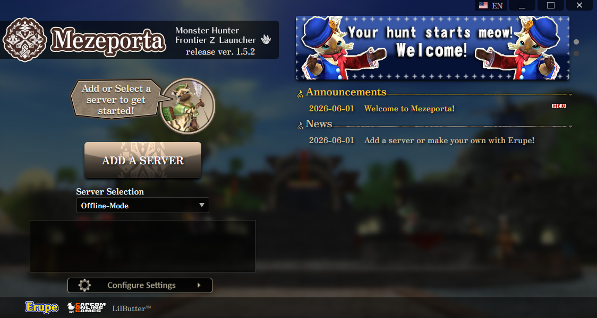 | 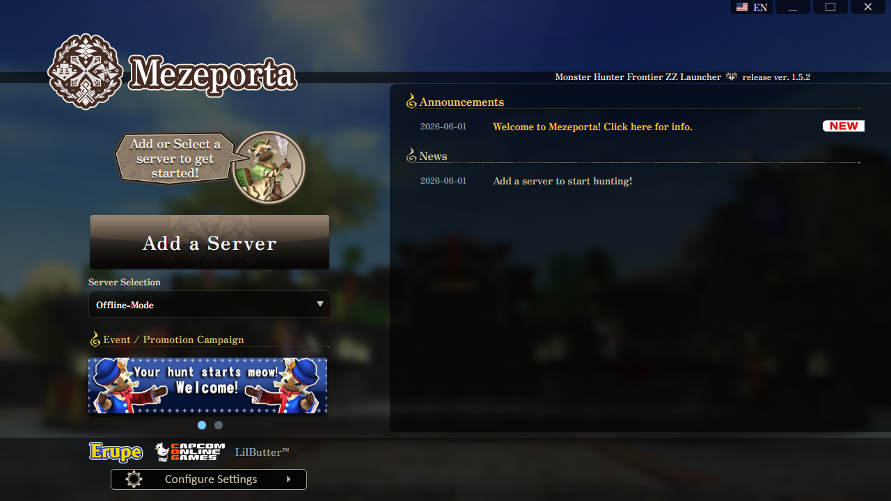 |

Initial boot will bring you to Offline-mode where you can add a server.

Last selected server will be used on next boot.

##
### Character Screen

| Classic | PS4 |
| --- | --- |
| 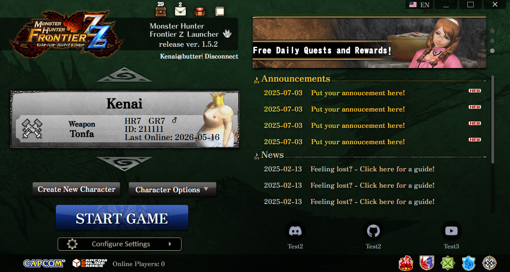 | 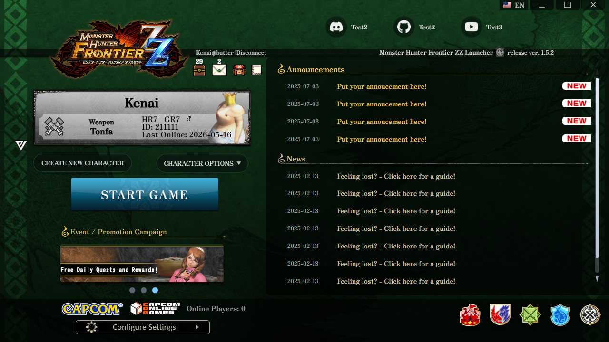 |

##
### Custom Images

Server Owners can provide the launcher with their own identity and artwork:
- Banners
- Headers
- Backgrounds
- ServerTag
- Cog
- Capcom
- Links
- Announcements
- News
- Server-patch
- Dialogue

Hunters can also provide their own images by enabling Offline-Images and placing the images in Mezeporta/Offline-Images/

(News, Announcements, Links, ServerTag and Banners are still provided by the server while Offline-Images are enabled.)

##
### Character Book
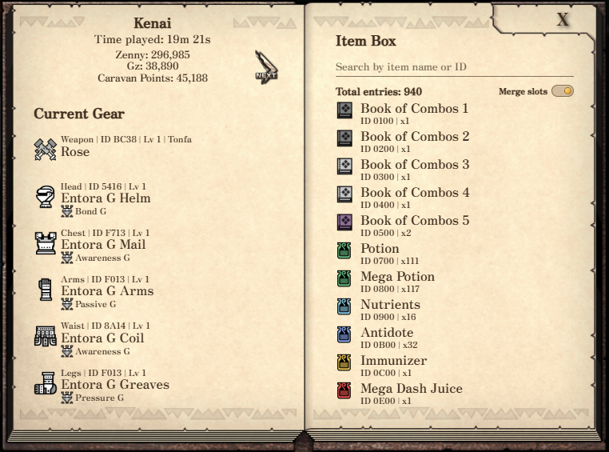

Character Book uses cached character savedata to provide equipment w/deco, currency, courses, itembox and playtime for the selected character.

Savedata cache is fetched at login and is cleared once the game starts. Savedata re-fetches only if cleared.

##
### Mail
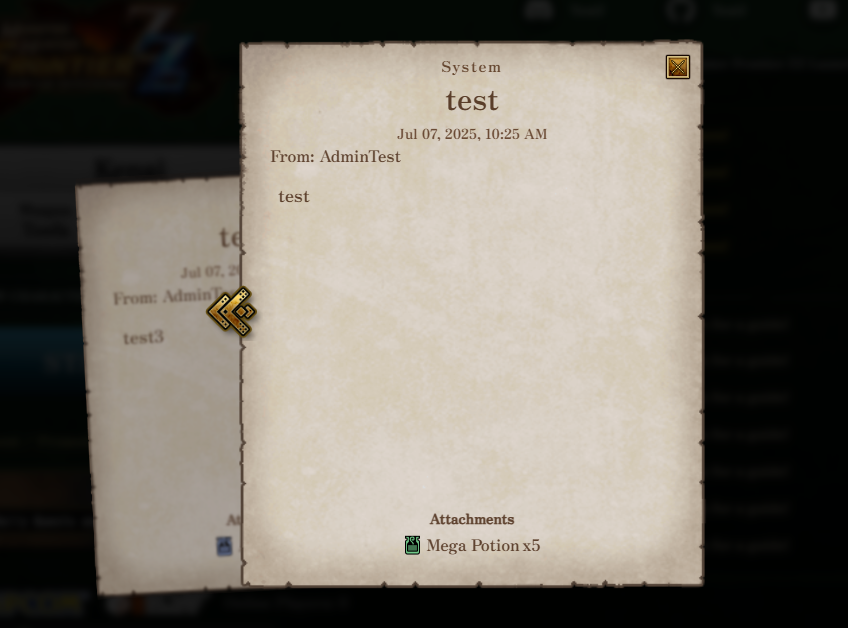

Mail shows player messages, system messages, guild invites, sender, dates, and item attachments.

##
### Distributions
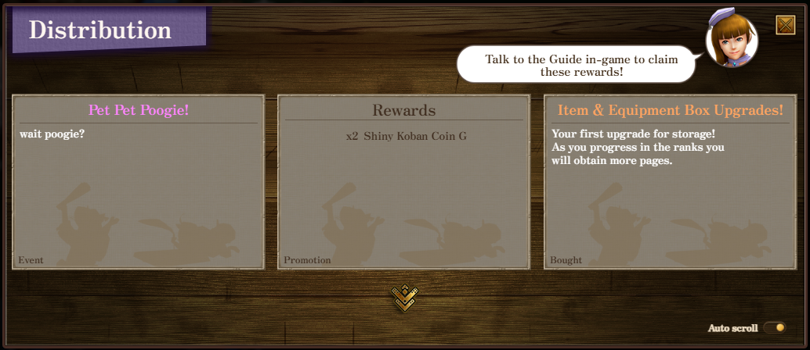

Distributions show unclaimed rewards with title, description, type, deadlines, color-coded text, item icons, and reward details.

##
### Friends List

| Small List | Large List |
| --- | --- |
| 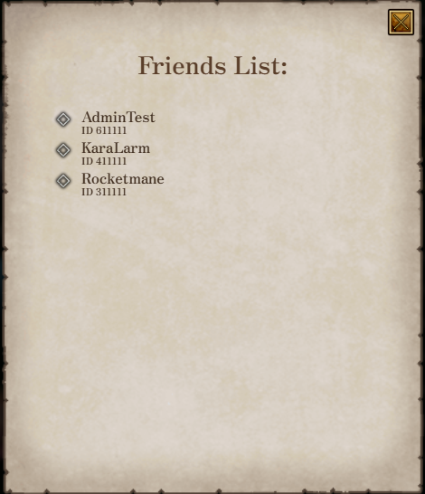 | 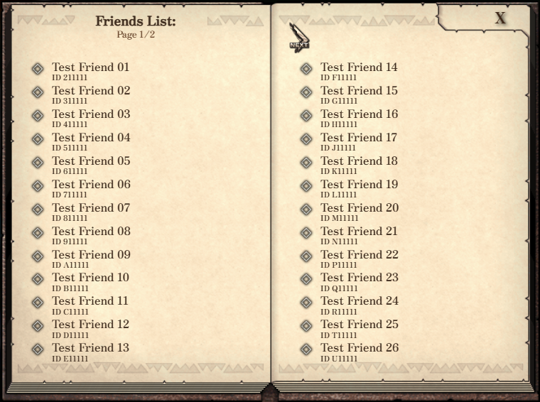 |

Friends list contains your friends for the selected character also providing an online/offline icon. The pop-up changes dynamically with the amount of friends you have. MAX 50 :)

##
### Events
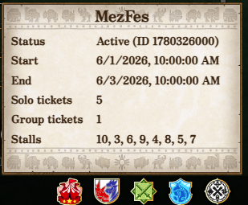

Active event buttons can appear in the footer area with their own information panels.
- MezFes
- Hunter Festa
- Diva
- Tenro/Tower
- Pallone Festival
- Conquest
- Hunting Tournament

##
### Settings

| Description open | Description closed |
| --- | --- |
| 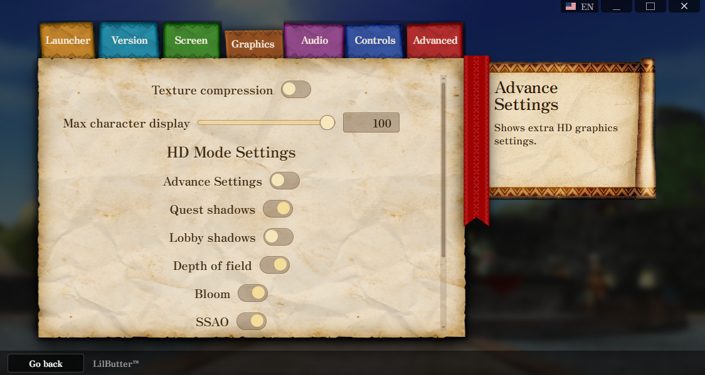 | 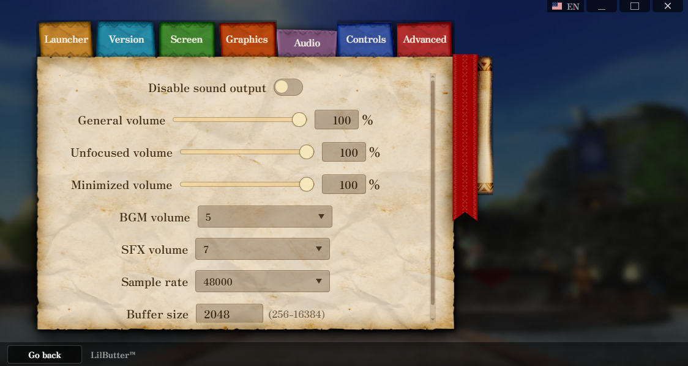 |

The Settings page provides options ranging from launcher specific settings like launcher resolution or font, all the way to advanced graphics, audio, wine-prefix, and more.

##
### Patching

Mezeporta has multi-server patch support!
- Checks the selected server for patch information.
- Compares patch data against the selected client folder and checks cached patches to reuse if the e-tag/manifest matches.
- Renames any original files to have the extension .mezeold (if previously patched, it will restore to original files first before applying the new patch)
- Downloads missing or outdated files provided by the wrapper.
- Caches patch files under Mezeporta/Servers


## 
### Windows Development

Requirements:

- Node.js and npm.
- Rustup.

Setup:

```powershell
npm install
rustup target add i686-pc-windows-msvc
```

Dev mode for styling/Frontend:

```powershell
npm run tauri:dev
```

Build:

```powershell
npm run tauri:build
```

##
### WSL Linux Development

WSL can be used from Windows to test or build the Linux launcher.

Linux and WSL builds need `src-tauri/bin/meze-deps.exe`. This helper is built on Windows because the Linux launcher still starts the Windows game client through Wine. (pre-compiled version is provided)

From Windows:

```powershell
npm install
rustup target add i686-pc-windows-msvc
npm run meze-deps:build
```

Inside WSL, install and verify Linux build dependencies:

```bash
npm install
./scripts/linux/install-build-deps-ubuntu.sh --install
./scripts/linux/install-build-deps-ubuntu.sh --verify
```

Run through WSL:

```powershell
npm run tauri:dev:linux:wsl
```

Run through WSL with the GPU helper for hardware acceleration:

```powershell
npm run tauri:dev:linux:wsl-gpu
```

Build through WSL:

```powershell
npm run tauri:build:linux:wsl
```

Build Tarball for linux through WSL:
```bash
npm run tauri:build:linux:portable:wsl
```

Optional WSL variables:

- `MEZEPORTA_WSL_DISTRO`: WSL distro name.
- `MEZEPORTA_WSL_GPU_ADAPTER`: GPU adapter name used by the WSL GPU helper.

##
### Native Linux Development

Requirements:

- Node.js and npm.
- Rustup.
- WebKitGTK and JavaScriptCoreGTK development packages.
- GStreamer packages for UI audio.
- `src-tauri/bin/meze-deps.exe`, built from Windows with `npm run meze-deps:build`.

Ubuntu-based systems:

```bash
./scripts/linux/install-build-deps-ubuntu.sh --install
./scripts/linux/install-build-deps-ubuntu.sh --verify
```

Arch-based systems:

```bash
./scripts/linux/install-build-deps-arch.sh --install
./scripts/linux/install-build-deps-arch.sh --verify
```

Dev mode for styling/Frontend:

```bash
npm run tauri:dev:linux
```

Build for AppImage and Deb:

```bash
npm run tauri:build:linux
```
Build Tarball for linux:
```bash
npm run tauri:build:linux:portable
```
